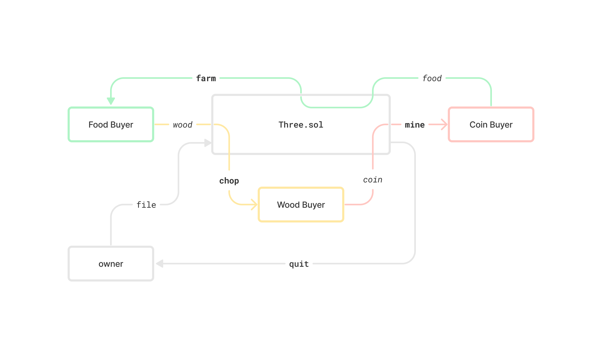
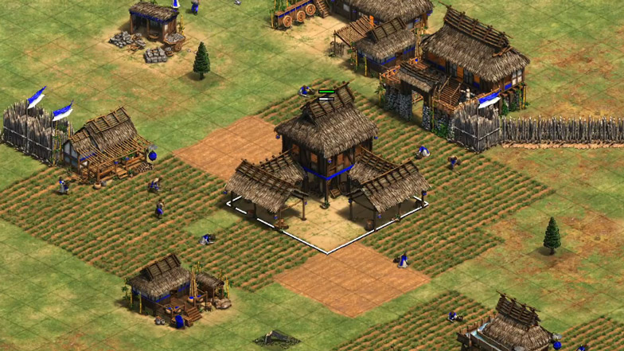

# Villager: Age of Empires Simulator in Solidity
smolbrain execution of a permissionless contract to make it easy to swap contracts between two or more parties. The contracts include `Two.sol`, a simple implementation with two assets and `Three.sol`, a version with three assets. Both implementations require ERC20 tokens, so won't function with Ether. 

The owner of the contract can set the rates at which resources are exchanged permissionlessly. A `quit()` function sweeps the balance to the owner in case of dust. As cross-rates are calculated with divisions, some imprecisions may occur in values under 10^18 decimals. Have not tested with brainlet tokens that don't use 10^18.

An example cross-table that could be produced is the following, although the contract only requires the rates for `woodFood` and `coinFood` to be set.

| Units of A in terms of B: | `food` | `wood` | `coin` |
| --- | --- | --- | --- |
| `food` | `-`|`0.20`|`0.33`|
 | `wood` | `5.00`|`-`|`1.67`|
 | `coin` | `3.00`|`0.60`|`-`|

 

## `Two.sol`

### `constructor(address food_, address wood_, address owner_)`
Requires addresses of two ERC20 tokens to deploy and the address of an owner contract or EOA. Owner will be the only one authorized to set rates and will be the destination for `quit()` calls.

### `file(uint256 woodFood_)`
Requires ownership. Sets the `woodFood` rate. 

### `farm(Resource name_, uint256 amount_)`
Permissionless function that allows the EOA or contract to deposit `wood` and retrieve `food` at the prevailing rate.

### `chop(Resource name_, uint256 amount_)`
Permissionless function that allows the EOA or contract to deposit `food` and retrieve `wood` at the prevailing rate.

### `quit()`
Permissionless function that sweeps the balance of `food` and `wood` into the `owner` address.

## `Three.sol`

### `constructor(address food_, address wood_, address coin_, address owner_)`
Requires addresses of two ERC20 tokens to deploy and the address of an owner contract or EOA. Owner will be the only one authorized to set rates and will be the destination for `quit()` calls.

### `file(uint256 woodFood_, uint256 coinFood_)`

In the `Three.sol` version also sets the `coinFood` rate.

### `farm(Resource name_, uint256 amount_)`
Permissionless function that allows the EOA or contract to deposit `wood` or `coin` and retrieve `food` at the prevailing rate.

### `chop(Resource name_, uint256 amount_)`
Permissionless function that allows the EOA or contract to deposit `food` or `coin` and retrieve `wood` at the prevailing rate.

### `mine(Resource name_, uint256 amount_)`
Permissionless function that allows the EOA or contract to deposit `food` or `wood` and retrieve `coin` at the prevailing rate.

### `quit()`
Permissionless function that sweeps the balance of `food`, `wood` and `coin` into the `owner` address.

## Deployment

- [Mainnet]()
- [Goerli]()

## Illustrated version of what I think is happening

